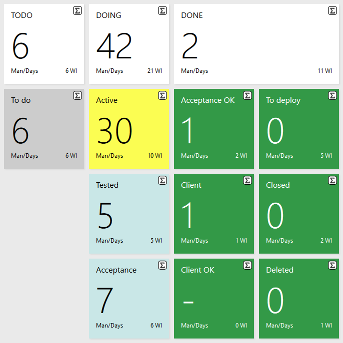
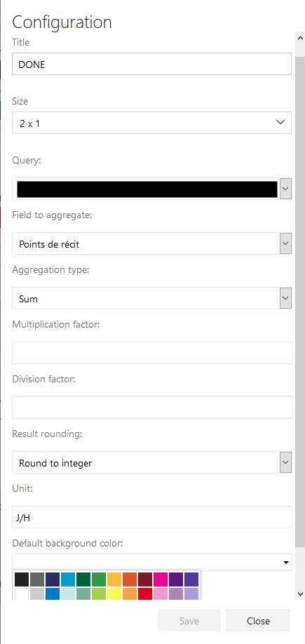

# QueryTile Extended

**Widget** for TFS and VSTS allowing to mimic the *QueryTile* widget with aggregation function :
- Sum
- Highest
- Lowest
- Average
- Count empty values
- Count non empty values

## HowTo
First look at the configuration :

First choose a name for your widget, and a size (currently 1x1 or 2x1).

Then choose a public query with the Query dropdown.

When done, it is the moment to choose the field on which you want to apply an aggregation function.

The field dropdown present you all integer or decimal field configured on your project, even if the chosen query doesn't returns it.

You can then choose to apply some multiplication or division factor (for days to hour conversion for example).

By applying some aggregation functions or division factor, you risk to have some decimal value, not really cool to present on a dashboard, that's why you can apply some rounding.

You can then round the result obtained, and apply a multiplication or division factor on it.

Finally you can set the unit of the aggregation result you will show, and the background color of the widget.

## Browser compatibility
The widget is working on :
- Firefox
- Chrome
- Edge
- Internet Explorer

Let me know if it is compatible or not on other browser.

## Evolution
If you have some ideas for this widget to evolve, don't be shy and contact me on [github](https://github.com/arsenikstiger/querytile-extended).

## License
The [code](https://github.com/arsenikstiger/querytile-extended) is open sourced under the [MIT license](license.md). We love and encourage community contributions.